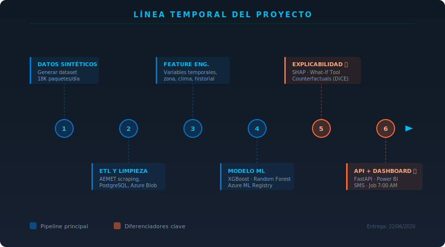

# 📦 RetailCore Logistics · Predictor de Fallos en Entrega
 

 
> **Tajamar Fight · Caso 01** — Sistema de predicción de fallos en entrega de última milla con IA explicable  
> **Equipo:** Alejandro Benítez · Borja Núñez · Marta Moreno · **Entrega:** 31/05/2026
 
---
 
## ✅ Tareas del proyecto
 
---
 
### — DATOS —
 assets
| Tarea | Responsable | Estado |
|---|---|---|
| Diseñar esquema del dataset | ❓ Por asignar | ⚪ Pendiente |
| <sub>Definir columnas: entrega_id, fecha, zona, destinatario_id, tipo_producto, repartidor_id, franja_horaria, resultado (0/1)</sub> | | |
| Generar dataset sintético | ❓ Por asignar | ⚪ Pendiente |
| <sub>Script Python: 18.000 paquetes/día × 180 días históricos (~3M registros). Tasa de fallo objetivo: ~23%</sub> | | |
| Inyectar señales reales de fallo | ❓ Por asignar | ⚪ Pendiente |
| <sub>Ajustar probabilidades por zona (centro +8%), día (viernes +12%), tipo producto (requiere firma +15%), reintento (+20%)</sub> | | |
| Scraping meteorológico AEMET | ❓ Por asignar | ⚪ Pendiente |
| <sub>Extraer datos históricos de lluvia, temperatura y viento en Madrid, Barcelona, Valencia y Sevilla</sub> | | |
| Generar tabla de destinatarios con historial | ❓ Por asignar | ⚪ Pendiente |
| <sub>Historial de fallos por destinatario (últimas 10 entregas), número de intentos previos fallidos</sub> | | |
| Generar tabla de repartidores | ❓ Por asignar | ⚪ Pendiente |
| <sub>Carga media diaria, zonas habituales, ratio de entregas pesadas</sub> | | |
| Validar distribución de fallos | ❓ Por asignar | ⚪ Pendiente |
| <sub>Verificar que el dataset tiene tasa de fallo ~23% y que las señales están bien correlacionadas</sub> | | |
 
---
 
### — ETL Y LIMPIEZA —
 
| Tarea | Responsable | Estado |
|---|---|---|
| Diseñar esquema PostgreSQL | ❓ Por asignar | ⚪ Pendiente |
| <sub>Tablas: `entregas`, `destinatarios`, `repartidores`, `zonas`, `meteorologia`. Script `schema.sql`</sub> | | |
| Cargar datos en PostgreSQL | ❓ Por asignar | ⚪ Pendiente |
| <sub>Script `load_to_postgres.py` con control de errores y logs</sub> | | |
| Subir datos a Azure Blob Storage | ❓ Por asignar | ⚪ Pendiente |
| <sub>Organización: `raw/YYYY-MM-DD/entregas.csv`. Contenedor separado para `processed/`</sub> | | |
| Notebook ETL y exploración | ❓ Por asignar | ⚪ Pendiente |
| <sub>Analizar distribuciones, % nulos por columna, outliers en tiempos y coordenadas</sub> | | |
| Limpieza de nulos y outliers | ❓ Por asignar | ⚪ Pendiente |
| <sub>Estrategia por columna: imputar mediana, imputar moda o eliminar fila. Documentar decisiones</sub> | | |
| Unir meteorología con entregas | ❓ Por asignar | ⚪ Pendiente |
| <sub>Join por fecha + ciudad. Verificar cobertura: todas las fechas deben tener datos meteorológicos</sub> | | |
| Dataset limpio a Azure Blob (`processed/`) | ❓ Por asignar | ⚪ Pendiente |
| <sub>Subir el dataset final limpio listo para feature engineering</sub> | | |
 
---
 
### — FEATURE ENGINEERING —
 
| Tarea | Responsable | Estado |
|---|---|---|
| Variables temporales | ❓ Por asignar | ⚪ Pendiente |
| <sub>Día de la semana (0-6), franja horaria (mañana/tarde/noche), si es festivo nacional o local</sub> | | |
| Variable de zona | ❓ Por asignar | ⚪ Pendiente |
| <sub>One-hot encoding: residencial, oficinas, polígono industrial, centro histórico</sub> | | |
| Variables meteorológicas | ❓ Por asignar | ⚪ Pendiente |
| <sub>Lluvia (mm), temperatura (°C), viento (km/h), flag de niebla (0/1)</sub> | | |
| Historial de fallos del destinatario | ❓ Por asignar | ⚪ Pendiente |
| <sub>Tasa de fallo histórica del destinatario (últimas 10 entregas), número de intentos previos fallidos totales</sub> | | |
| Tipo de producto | ❓ Por asignar | ⚪ Pendiente |
| <sub>Flags binarios: requiere_firma, frágil, voluminoso, alto_valor (precio > 100€)</sub> | | |
| Variable primer intento vs. reintento | ❓ Por asignar | ⚪ Pendiente |
| <sub>`es_reintento` (0/1) + `num_intento` (1, 2, 3...) por entrega</sub> | | |
| Carga del repartidor | ❓ Por asignar | ⚪ Pendiente |
| <sub>Número de entregas asignadas ese día, ratio de entregas de alto valor / total</sub> | | |
| Verificar ausencia de data leakage | ❓ Por asignar | ⚪ Pendiente |
| <sub>Comprobar que ninguna feature usa información posterior a la fecha de la entrega que se predice</sub> | | |
| Documentar todas las features | ❓ Por asignar | ⚪ Pendiente |
| <sub>Tabla en `docs/features.md`: nombre, descripción, unidad, rango esperado y cómo se calcula</sub> | | |
 
---
 
### — MODELO ML —
 
| Tarea | Responsable | Estado |
|---|---|---|
| Preparar splits de entrenamiento y test | ❓ Por asignar | ⚪ Pendiente |
| <sub>Split temporal: train = datos hasta 3 meses atrás, test = último mes. Nunca split aleatorio</sub> | | |
| Entrenar Random Forest (baseline) | ❓ Por asignar | ⚪ Pendiente |
| <sub>`n_estimators=200`, `max_depth=8`, validación cruzada temporal k=5. Registrar AUC-ROC, Precision, Recall, F1</sub> | | |
| Entrenar XGBoost | ❓ Por asignar | ⚪ Pendiente |
| <sub>`learning_rate=0.05`, `n_estimators=500`, `scale_pos_weight` para el desbalanceo de clases</sub> | | |
| Comparar modelos y seleccionar ganador | ❓ Por asignar | ⚪ Pendiente |
| <sub>Si diferencia AUC < 2% → Random Forest (más interpretable). Si no → XGBoost. Justificar decisión</sub> | | |
| Registrar modelo en Azure ML Model Registry | ❓ Por asignar | ⚪ Pendiente |
| <sub>Subir con nombre `retailcore-fallo-predictor`, versión, métricas y fecha. Objetivo: AUC-ROC ≥ 0.80</sub> | | |
| Documentar métricas finales | ❓ Por asignar | ⚪ Pendiente |
| <sub>Añadir tabla de resultados (AUC-ROC, Precision, Recall, F1, umbral óptimo) a `docs/metricas.md`</sub> | | |
 
---
 
### — EXPLICABILIDAD (diferenciadores) —
 
| Tarea | Responsable | Estado |
|---|---|---|
| Implementar módulo SHAP | ❓ Por asignar | ⚪ Pendiente |
| <sub>Para cada predicción: devolver los 3 factores más influyentes con su efecto en probabilidad (+/-)</sub> | | |
| Validar explicaciones con ejemplos reales | ❓ Por asignar | ⚪ Pendiente |
| <sub>Ejecutar SHAP sobre 10 entregas sintéticas y verificar que la explicación tiene sentido operativo</sub> | | |
| ⭐ Implementar What-If Tool | ❓ Por asignar | ⚪ Pendiente |
| <sub>Función que permite cambiar una feature (ej: franja horaria → tarde) y recalcular la probabilidad sin reentrenar</sub> | | |
| ⭐ Implementar Counterfactuals (DiCE) | ❓ Por asignar | ⚪ Pendiente |
| <sub>Para cada entrega de alto riesgo: "¿qué habría que cambiar para que la prob. de fallo baje del 30%?"</sub> | | |
 
---
 
### — BACKEND Y API —
 
| Tarea | Responsable | Estado |
|---|---|---|
| Estructura del proyecto FastAPI | ❓ Por asignar | ⚪ Pendiente |
| <sub>Crear app con routers separados: `/predict`, `/report/today`, `/health`. Documentación Swagger automática</sub> | | |
| Endpoint `POST /predict` | ❓ Por asignar | ⚪ Pendiente |
| <sub>Recibe lista de entregas → devuelve lista priorizada con probabilidad de fallo y top 3 factores SHAP</sub> | | |
| Integración con Azure ML Online Endpoint | ❓ Por asignar | ⚪ Pendiente |
| <sub>Llamar al endpoint de Azure ML desde la API con autenticación por Managed Identity</sub> | | |
| Job automático antes de las 7:00 AM | ❓ Por asignar | ⚪ Pendiente |
| <sub>Azure Functions o cron: leer entregas del día siguiente de PostgreSQL, llamar al modelo, guardar predicciones</sub> | | |
| Notificaciones con Azure Logic Apps | ❓ Por asignar | ⚪ Pendiente |
| <sub>Si prob. fallo > 70% → SMS automático al destinatario + alerta al operador por email/Teams</sub> | | |
| Umbral de notificación configurable | ❓ Por asignar | ⚪ Pendiente |
| <sub>El umbral (70% por defecto) debe ser modificable sin tocar código, via variable de entorno o config</sub> | | |
 
---
 
### — DASHBOARD OPERATIVO —
 
| Tarea | Responsable | Estado |
|---|---|---|
| Conectar Power BI a PostgreSQL | ❓ Por asignar | ⚪ Pendiente |
| <sub>Fuente de datos: tabla `predicciones_diarias` actualizada cada mañana por el job automático</sub> | | |
| Vista principal: lista priorizada del día | ❓ Por asignar | ⚪ Pendiente |
| <sub>Tabla ordenada por probabilidad de fallo con semáforo visual (verde/naranja/rojo) y top factores</sub> | | |
| ⭐ Mapa de calor por zona | ❓ Por asignar | ⚪ Pendiente |
| <sub>Mapa de Madrid/BCN/Valencia/Sevilla con intensidad de fallos previstos por zona geográfica</sub> | | |
| Panel de explicación por entrega | ❓ Por asignar | ⚪ Pendiente |
| <sub>Al hacer clic en una entrega: muestra los 3 factores SHAP explicados en lenguaje natural para el operador</sub> | | |
| KPIs del día | ❓ Por asignar | ⚪ Pendiente |
| <sub>Tarjetas resumen: total entregas, % alto riesgo, SMS enviados, comparativa con el día anterior</sub> | | |
| Informe PDF/Excel automático | ❓ Por asignar | ⚪ Pendiente |
| <sub>Exportación del informe diario para operadores sin acceso directo a Power BI</sub> | | |
 
---
 
### — DOCUMENTACIÓN Y ENTREGA —
 
| Tarea | Responsable | Estado |
|---|---|---|
| Documentar features | ❓ Por asignar | ⚪ Pendiente |
| <sub>Tabla en `docs/features.md` con nombre, descripción, unidad, rango esperado y cómo se calcula cada variable</sub> | | |
| Documentar métricas del modelo | ❓ Por asignar | ⚪ Pendiente |
| <sub>Tabla en `docs/metricas.md` con AUC-ROC, Precision, Recall, F1 y comparativa entre modelos</sub> | | |
| Estimación de costes en producción | ❓ Por asignar | ⚪ Pendiente |
| <sub>Desglose mensual por servicio Azure en `docs/costes.md`. Incluir escenario mínimo y escenario completo</sub> | | |
| Arquitectura completa documentada | ❓ Por asignar | ⚪ Pendiente |
| <sub>Diagrama y descripción de todas las capas tal como irían a producción real, aunque no se implementen todas</sub> | | |
| Demo funcional con datos sintéticos | ❓ Por asignar | ⚪ Pendiente |
| <sub>Ejecutar el pipeline completo end-to-end: datos → modelo → API → predicción con explicación</sub> | | |
| Presentación final del proyecto | ❓ Por asignar | ⚪ Pendiente |
| <sub>Preparar demo + slides para la exposición ante el jurado (resto de la clase como clientes)</sub> | | |

> **Estados:** ✅ Hecho · 🟡 En curso · ⚪ Pendiente · 🔴 AVISAR YA
 
---
 
## 🗺️ Línea temporal
 

 
---
 
## 🏗️ Arquitectura de la solución
 

 
```
┌─────────────────────────────────────────────────────────────────┐
│  CAPA 1 · DATOS                                                 │
│  Datos sintéticos + scraping AEMET ──► PostgreSQL ──► Azure Blob│
├─────────────────────────────────────────────────────────────────┤
│  CAPA 2 · MACHINE LEARNING  (Azure ML)                          │
│  XGBoost / RF ──► SHAP ──► Azure ML Registry ──► Endpoint      │
│  ⭐ What-If Tool · Counterfactuals DiCE                         │
├─────────────────────────────────────────────────────────────────┤
│  CAPA 3 · BACKEND                                               │
│  FastAPI ──► Azure Functions (job 7AM) ──► Logic Apps (SMS)    │
├─────────────────────────────────────────────────────────────────┤
│  CAPA 4 · SALIDA OPERATIVA                                      │
│  Power BI Dashboard · Lista priorizada · Mapa de calor ⭐       │
└─────────────────────────────────────────────────────────────────┘
```
 
---
 
## ⭐ Diferenciadores frente a la competencia
 
| Diferenciador | Qué aporta al cliente |
|---|---|
| **What-If Tool** | El operador simula "¿qué pasa si cambio la franja a la tarde?" antes de decidir |
| **Counterfactuals (DiCE)** | El sistema explica qué habría que cambiar para evitar el fallo |
| **Mapa de calor Power BI** | Vista geográfica de zonas de riesgo, intuitiva para operadores no técnicos |
| **SMS proactivo antes 7:00 AM** | Notificación automática al destinatario con alternativas de horario |
| **Explicación por entrega** | No solo "alto riesgo", sino "falla porque llueve + centro + lunes + reintento" |
 
---
 
## 💰 Estimación de costes en producción
 
> Detalle completo → [`docs/costes.md`](docs/costes.md)
 
| Servicio | Coste estimado/mes |
|---|---|
| Azure ML (endpoint + compute) | ~60 € |
| Azure PostgreSQL Flexible | ~30 € |
| Azure Blob Storage | ~5 € |
| Azure Functions + Logic Apps | ~12 € |
| Power BI Premium Per User | ~20 € |
| **Total estimado** | **~127 €/mes** |
 
---
 
## 📁 Estructura del repositorio
 
```
retailcore-predictor/
│
├── 📂 assets/
│   ├── banner.svg
│   ├── arquitectura.svg
│   └── timeline.svg
│
├── 📂 data/
│   ├── generate_synthetic.py         # Generación del dataset sintético
│   ├── scraping_aemet.py             # Meteorología desde AEMET API
│   └── schema.sql                    # Esquema PostgreSQL
│
├── 📂 ml_pipeline/
│   ├── etl_limpieza.ipynb            # ETL, exploración y limpieza
│   ├── feature_engineering.ipynb     # Feature engineering completo
│   ├── train_model.ipynb             # Entrenamiento XGBoost / RF
│   └── shap_explainability.ipynb     # SHAP + What-If + Counterfactuals
│
├── 📂 api/
│   ├── main.py                       # FastAPI app
│   ├── predict.py                    # Endpoint /predict
│   ├── report.py                     # Endpoint /report/today
│   └── scheduler.py                  # Job automático 6:45 AM
│
├── 📂 dashboard/
│   └── retailcore.pbix               # Power BI report
│
├── 📂 docs/
│   ├── features.md                   # Tabla de features documentadas
│   ├── metricas.md                   # Resultados del modelo
│   └── costes.md                     # Estimación de costes en producción
│
├── .env.example
├── requirements.txt
└── README.md
```
 
---
 
## 🛠️ Setup rápido
 
```bash
# 1. Clonar el repo
git clone https://github.com/team# RetailCore Logistics · Predictor de Fallos en Entrega


> **Tajamar Fight · Caso 01** · Predicción de fallos en entrega de última milla con IA explicable  
> **Entrega:** 22/06/2026 · **Stack:** Azure ML · XGBoost · FastAPI · SHAP · Power BI

---


| Miembro | Rol | Detalle de tareas |
|---|---|---|
| Alejandro Benítez | ML Lead | [📄 ver tareas](team/alejandro.md) |
| Borja Núñez | Data Engineer | [📄 ver tareas](team/borja.md) |
| Marta Moreno | Backend & Frontend Lead | [📄 ver tareas](team/marta.md) |

---

## 🎯 El problema que resolvemos

RetailCore mueve **18.000 paquetes/día** en Madrid, Barcelona, Valencia y Sevilla. Su tasa de fallo en primer intento es del **23%** — cada fallo cuesta dinero: el repartidor vuelve al hub, el paquete se reintenta y el cliente puede devolver el pedido.

**Nuestra solución:** un sistema que, antes de las 7:00 AM, genera una lista priorizada de las entregas con mayor riesgo de fallo ese día, junto con una explicación concreta de por qué se va a fallar — para que el operador pueda actuar.

---

## 🗺️ Arquitectura de la solución


```
┌─────────────────────────────────────────────────────────────────┐
│  CAPA 1 · DATOS                                                 │
│  Datos sintéticos + scraping ──► PostgreSQL ──► Azure Blob      │
├─────────────────────────────────────────────────────────────────┤
│  CAPA 2 · MACHINE LEARNING  (Azure ML)                          │
│  XGBoost / RF ──► SHAP Explainability ──► Azure ML Registry    │
│  ⭐ What-If Tool · Counterfactuals (diferenciador)              │
├─────────────────────────────────────────────────────────────────┤
│  CAPA 3 · BACKEND                                               │
/retailcore-predictor.git
cd retailcore-predictor
 
# 2. Instalar dependencias
pip install -r requirements.txt
 
# 3. Configurar variables de entorno
cp .env.example .env
# Editar .env con credenciales de Azure y PostgreSQL
 
# 4. Generar datos sintéticos
python data/generate_synthetic.py
 
# 5. Lanzar la API
uvicorn api.main:app --reload
```
 
---
 
## 📋 Flujo de trabajo del equipo
 
```
1. git pull                          ← Siempre primero
2. Trabajar en tu rama               ← Nunca directamente en main
3. git add · git commit · git push   ← Commits pequeños y descriptivos
4. Pull Request a main               ← El otro lo revisa antes de mergear
```
 
**Formato de commits:**
```
feat: generar dataset sintético con señales de fallo reales
fix: corregir join meteorología por ciudad
docs: añadir tabla de features a docs/features.md
