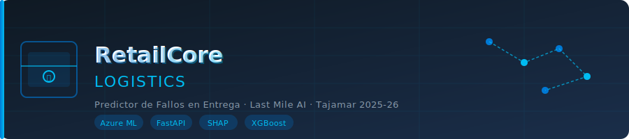
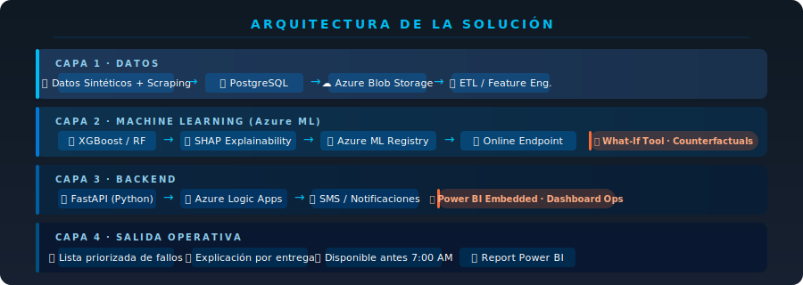

# RetailCore Logistics · Predictor de Fallos en Entrega



> **Tajamar Fight · Caso 01** · Predicción de fallos en entrega de última milla con IA explicable  
> **Entrega:** 22/06/2026 · **Stack:** Azure ML · XGBoost · FastAPI · SHAP · Power BI

---


| Miembro | Rol | Detalle de tareas |
|---|---|---|
| Alejandro Benítez | ML Lead | [📄 ver tareas](team/alejandro.md) |
| Borja Núñez | Data Engineer | [📄 ver tareas](team/borja.md) |
| Marta Moreno | Backend & Frontend Lead | [📄 ver tareas](team/marta.md) |

---

## 🎯 El problema que resolvemos

RetailCore mueve **18.000 paquetes/día** en Madrid, Barcelona, Valencia y Sevilla. Su tasa de fallo en primer intento es del **23%** — cada fallo cuesta dinero: el repartidor vuelve al hub, el paquete se reintenta y el cliente puede devolver el pedido.

**Nuestra solución:** un sistema que, antes de las 7:00 AM, genera una lista priorizada de las entregas con mayor riesgo de fallo ese día, junto con una explicación concreta de por qué se va a fallar — para que el operador pueda actuar.

---

## 🗺️ Arquitectura de la solución



```
┌─────────────────────────────────────────────────────────────────┐
│  CAPA 1 · DATOS                                                 │
│  Datos sintéticos + scraping ──► PostgreSQL ──► Azure Blob      │
├─────────────────────────────────────────────────────────────────┤
│  CAPA 2 · MACHINE LEARNING  (Azure ML)                          │
│  XGBoost / RF ──► SHAP Explainability ──► Azure ML Registry    │
│  ⭐ What-If Tool · Counterfactuals (diferenciador)              │
├─────────────────────────────────────────────────────────────────┤
│  CAPA 3 · BACKEND                                               │
│  FastAPI ──► Azure Logic Apps ──► SMS / Email / Push            │
│  ⭐ Power BI Embedded · Dashboard operadores                    │
├─────────────────────────────────────────────────────────────────┤
│  CAPA 4 · SALIDA OPERATIVA (antes 7:00 AM)                      │
│  Lista priorizada · Explicación por entrega · Report Power BI  │
└─────────────────────────────────────────────────────────────────┘
```

---

## ✅ Tareas del proyecto

### 📊 Datos y ETL

| Tarea | Responsable | Estado |
|---|---|---|
| Diseño del dataset sintético (señales de fallo) | Borja | ⚪ Pendiente |
| Generación de datos: 18.000 paquetes/día × histórico | Borja | ⚪ Pendiente |
| Scraping meteorológico (AEMET API) | Borja | ⚪ Pendiente |
| Integración con PostgreSQL local + esquema | Borja | ⚪ Pendiente |
| Subida a Azure Blob Storage (raw/) | Borja | ⚪ Pendiente |
| ETL y limpieza de datos (nulos, outliers) | Borja | ⚪ Pendiente |

### 🔧 Feature Engineering

| Tarea | Responsable | Estado |
|---|---|---|
| Variables temporales (día semana, franja horaria) | Alejandro | ⚪ Pendiente |
| Variable zona (residencial, oficinas, polígono, centro) | Alejandro | ⚪ Pendiente |
| Variable meteorológica (lluvia, temperatura, viento) | Alejandro | ⚪ Pendiente |
| Historial de fallos del destinatario | Alejandro | ⚪ Pendiente |
| Tipo de producto (firma, frágil, voluminoso, alto valor) | Alejandro | ⚪ Pendiente |
| Variable primer intento vs. reintento | Alejandro | ⚪ Pendiente |
| Carga de trabajo del repartidor ese día | Alejandro | ⚪ Pendiente |
| Verificar ausencia de data leakage | Alejandro | ⚪ Pendiente |
| Documentar todas las features (tabla en `docs/`) | Alejandro | ⚪ Pendiente |

### 🤖 Modelo ML

| Tarea | Responsable | Estado |
|---|---|---|
| Split temporal train/test (nunca aleatorio) | Alejandro | ⚪ Pendiente |
| Entrenar Random Forest (baseline) | Alejandro | ⚪ Pendiente |
| Entrenar XGBoost (candidato principal) | Alejandro | ⚪ Pendiente |
| Comparar modelos (AUC-ROC, Precision, Recall, F1) | Alejandro | ⚪ Pendiente |
| Seleccionar modelo ganador y justificar | Alejandro | ⚪ Pendiente |
| Registrar modelo en Azure ML Model Registry | Alejandro | ⚪ Pendiente |
| Documentar métricas finales | Alejandro | ⚪ Pendiente |

### 🔍 Explicabilidad (diferenciador clave)

| Tarea | Responsable | Estado |
|---|---|---|
| Implementar SHAP (top 3 factores por predicción) | Alejandro | ⚪ Pendiente |
| ⭐ What-If Tool: simular cambios de franja horaria | Alejandro | ⚪ Pendiente |
| ⭐ Counterfactuals: "¿qué habría que cambiar para que no fallase?" | Alejandro | ⚪ Pendiente |
| Validar que las explicaciones tienen sentido operativo | Alejandro | ⚪ Pendiente |

### 🚀 Backend y API

| Tarea | Responsable | Estado |
|---|---|---|
| API REST con FastAPI (endpoint `/predict`) | Marta | ⚪ Pendiente |
| Job programado: ejecución automática antes 7:00 AM | Marta | ⚪ Pendiente |
| Integración con Azure ML Online Endpoint | Marta | ⚪ Pendiente |
| Azure Logic Apps → SMS / Email al destinatario | Marta | ⚪ Pendiente |
| Integración con PostgreSQL de RetailCore | Marta | ⚪ Pendiente |

### 📊 Dashboard operativo (diferenciador clave)

| Tarea | Responsable | Estado |
|---|---|---|
| ⭐ Dashboard Power BI Embedded (lista priorizada del día) | Marta | ⚪ Pendiente |
| Vista por repartidor: sus entregas de riesgo | Marta | ⚪ Pendiente |
| Vista por zona: mapa de calor de fallos previstos | Marta | ⚪ Pendiente |
| Informe diario automático (PDF / Excel) | Marta | ⚪ Pendiente |

### 📝 Documentación y entrega

| Tarea | Responsable | Estado |
|---|---|---|
| Estimación de costes en producción (mensual) | Todos | ⚪ Pendiente |
| Arquitectura completa documentada | Todos | ⚪ Pendiente |
| Presentación final del proyecto | Todos | ⚪ Pendiente |
| Demo funcional con datos sintéticos | Todos | ⚪ Pendiente |

> **Estados:** ✅ Hecho · 🟡 En curso · ⚪ Pendiente · 🔴 AVISAR

---

## ⭐ Nuestros diferenciadores frente a la competencia

| Diferenciador | Qué aporta |
|---|---|
| **What-If Tool** | El operador puede simular "¿qué pasa si cambio la entrega a la tarde?" antes de decidir |
| **Counterfactuals** | El sistema explica qué habría que cambiar para que una entrega fallida no lo fuera |
| **Power BI Embedded** | Dashboard visual e intuitivo para operadores no técnicos, integrado en su flujo de trabajo |
| **Notificación automática al destinatario** | SMS proactivo antes de 7:00 AM con alternativas de horario |
| **Explicación por entrega** | No solo "alto riesgo", sino "falla porque llueve + zona centro + reintento + lunes" |

---

## 📁 Estructura del repositorio

```
retailcore-predictor/
│
├── 📂 assets/                        # Imágenes del README
│   ├── banner.svg
│   ├── arquitectura.svg
│   └── equipo.svg
│
├── 📂 data/
│   ├── generate_synthetic.py         # Generación de dataset sintético
│   ├── scraping_aemet.py             # Meteorología desde AEMET API
│   └── schema.sql                    # Esquema PostgreSQL
│
├── 📂 ml_pipeline/
│   ├── feature_engineering.ipynb     # Feature engineering completo
│   ├── train_model.ipynb             # Entrenamiento XGBoost / RF
│   ├── shap_explainability.ipynb     # Módulo SHAP + What-If + Counterfactuals
│   └── register_model.py             # Registro en Azure ML
│
├── 📂 api/
│   ├── main.py                       # FastAPI app
│   ├── predict.py                    # Endpoint /predict
│   └── scheduler.py                  # Job 7:00 AM
│
├── 📂 dashboard/assets
│   └── retailcore.pbix               # Power BI report
│
├── 📂 docs/
│   ├── features.md                   # Tabla de features documentadas
│   ├── metricas.md                   # Resultados del modelo
│   └── costes.md                     # Estimación de costes en producción
│
├── 📂 team/
│   ├── alejandro.md                  # Tareas de Alejandro
│   ├── borja.md                      # Tareas de Borja
│   └── marta.md                      # Tareas de Marta
│
├── .env.exampleassets
├── requirements.txt
└── README.md
```

---

## 🛠️ Setup rápido

```bash
# 1. Clonar el repo
git clone https://github.com/team/retailcore-predictor.git
cd retailcore-predictor

# 2. Instalar dependencias
pip install -r requirements.txt

# 3. Configurar variables de entorno
cp .env.example .env
# Editar .env con tus credenciales de Azure y PostgreSQL

# 4. Generar datos sintéticos
python data/generate_synthetic.py

# 5. Lanzar la API
uvicorn api.main:app --reload
```

### Variables de entorno necesarias

```
AZURE_ML_WORKSPACE=...
AZURE_ML_SUBSCRIPTION=...
AZURE_BLOB_CONNECTION_STRING=...
POSTGRES_HOST=...
POSTGRES_DB=retailcore
POSTGRES_USER=...
POSTGRES_PASSWORD=...
AEMET_API_KEY=...
```

---

## 💰 Estimación de costes en producción

> Detalle completo → [`docs/costes.md`](docs/costes.md)

| Servicio | Coste estimado/mes |
|---|---|
| Azure ML (endpoint + compute) | ~60 € |
| Azure PostgreSQL Flexible | ~30 € |
| Azure Blob Storage | ~5 € |
| Azure Logic Apps (notificaciones) | ~10 € |
| Power BI Premium Per User | ~20 € |
| **Total estimado** | **~125 €/mes** |

---

## 📋 Flujo de trabajo del equipo

```bash
# Siempre primero
git pull origin main

# Trabajar en tu rama
git checkout -b feat/nombre-tarea

# Commits descriptivos
git commit -m "feat: implementar SHAP con top 3 factores"

# Pull Request a main — el otro lo revisa antes de mergear
```
